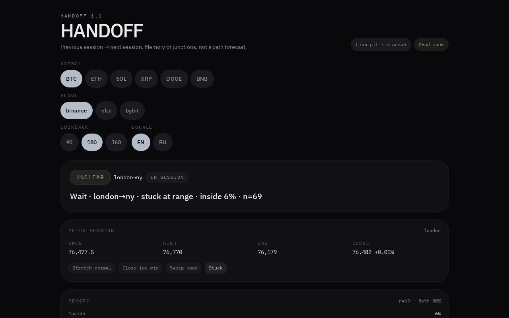

# HANDOFF

**HANDOFF-1.1** — previous session → next session. Memory of junctions, not a path forecast.

A public session-junction card for crypto desks. At Asia / London / NY handoffs it classifies what usually happens next:

- **lean:** `continue` | `break` | `unclear`
- **memory:** historical frequencies for the current bucket (`inside` / `brokeHigh` / `brokeLow`)

It does **not** forecast a path inside New York, and it is **not** an order.

> Session junction. Do not pick a side from this layer while `awaiting` / `unclear` / `thin` / `stuck` or `n < 40`.



## What this is

| This layer | Not this layer |
| --- | --- |
| Filter at the session junction | An entry / buy / sell signal |
| Session OHLC geometry only | Path forecast inside NY |
| Empirical memory of similar junctions | Gravity, ANVIL, or COIL blended into `pContinue` |
| `source: "live"` or `"demo"` | A venue id used as a data source |

If the card is `unclear`, `awaiting`, `thin`, `stuck`, or `n < 40`, do nothing from this indicator.

## Public API

No authentication. CORS `*` on GET. Invalid query values fall back to defaults (no 400).

```bash
# Compact desk card (flattened numbers)
GET /api/desk?symbol=BTC&lookback=180

# Full snapshot
GET /api/handoff?symbol=BTC&venue=okx&lookback=180

# JSON / CSV / schema export
GET /api/export?symbol=BTC&lookback=180&format=json

# Ranked pits — live first, then volume
GET /api/venues
```

Wire a downstream desk with:

```text
HANDOFF_API_BASE=<this origin>
```

`GET $HANDOFF_API_BASE/api/desk?symbol=BTC&lookback=180`

Omitted `venue` resolves to `/api/venues`.default — the first **live** pit, never high-volume demo Binance.

Full contract: [docs/API.md](docs/API.md)

## Session clock (America/New_York)

| Session | Hours (ET) |
| --- | --- |
| Asia | 19:00–03:00 |
| London | 03:00–08:00 |
| New York | 08:00–16:00 |
| Wait (NY close) | 16:00–19:00 → junction `ny_to_asia`, `awaiting=true` |

Junctions: `ny_to_asia` · `asia_to_london` · `london_to_ny`

## Venues

Pits: Binance, OKX, Bybit.

Ranking: **live first**, then `volumeUsd` descending, then `id`. `source` is only `"live"` or `"demo"` — never a venue id. Demo rows stay demo so a downstream desk will not vote them.

## Stack

TanStack Start · Vite · React 19 · TanStack Query · Recharts · Tailwind v4 · Zod

Poll 15s. Server cache 12s. Public 1h OHLC; deterministic demo fallback when a pit is unreachable.

## Quick start

```bash
npm install
npm run dev
```

```bash
npm test
npm run typecheck
npm run build
```

UI locale: EN / RU. The Russian rule copy is the same filter:

> Стык сессий. Сторону из этого слоя не выбирать, пока awaiting / unclear / thin / stuck или n < 40.

## Disclaimer

HANDOFF is a research filter, not financial advice and not a trading system. Past session geometry does not guarantee future results. Do not place orders from this card.

## License

MIT © Lucky Trends
